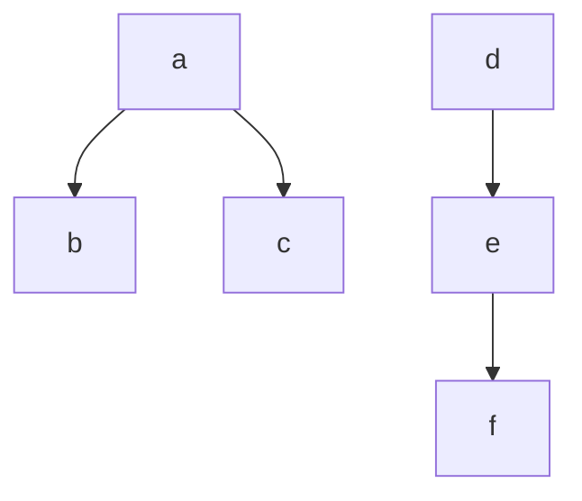

## Задание №5 (2 практических занятия)

## Реализация структур данных «Граф» средствами языков программирования высокого уровня

### Отчёт по пз
Код, загруженный в личный репозиторий gitlabnto. Для сдачи задания необходимо:
1. Реализовать код по заданию.
    2. Реализовать тесты к написанному коду с использованием Catch.
3. Ответить на теоретические вопросы по заданию.
4. Загрузить код в gitlabnto (каталог task2-5).

**Обязательно** наличия комментария с заданием в начале файла с реализацией алгоритма.

### Задание для самостоятельной работы

Номер варианта: (номер по журналу по модулю 8) + 1.

Реализовать в виде класса.
Конструктор класса должен принимать на вход строку, описывающую структуру графа, вида:
```bash
a,b,c,d,e,f,ab,ca,de,ef
```
которая говорит о том что:
* граф состоит из шести вершин **a,b,c,d,e** и **f**. Для выполнения данного задания принимается ограничение на максимальное количество вершин равное 26.
* существуют ребра из **a** в **b**, из **a** в **c**, из **d** в **e** и из **e** в **f** при этом направление важно только для орграфа.




* Функция поиска должна возвращать последовательность вершин вида **"a,b,c,d,e,f"**
* Функция выделения должна возвращать последовательность связных компонент вида **"abc,def"**.

Варианты:
1.	Граф неориентированный. Поиск в ширину с помощью матрицы смежности.  Выделение связных компонент.

2.	Граф неориентированный. Поиск в ширину с помощью списка смежности.  Выделение связных компонент.

3.	Граф неориентированный. Поиск в глубину с помощью матрицы смежности.  Выделение связных компонент.

4.	Граф неориентированный. Поиск в глубину с помощью списка смежности.  Выделение связных компонент.

5.	Граф ориентированный. Поиск в ширину с помощью матрицы смежности.  Выделение сильно связных компонент.

6.	Граф ориентированный. Поиск в ширину с помощью списка смежности.  Выделение сильно связных компонент.

7.	Граф ориентированный. Поиск в глубину с помощью матрицы смежности. Выделение сильно связных компонент.

8.	Граф ориентированный. Поиск в глубину с помощью списка смежности.  Выделение сильно связных компонент.

